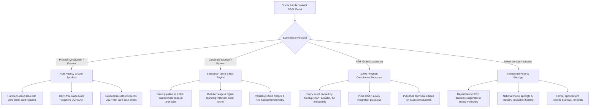

# MASTER WEBSITE CREATION & BRAND GUIDELINES GUIDE
## Single Source of Truth (SSOT), Pitch Architecture & Web Engineering Blueprint
**Location:** [`Website/00_MASTER_WEBSITE_CREATION_AND_BRAND_GUIDE.md`](file:///e:/AWS%20SBGL/Website/00_MASTER_WEBSITE_CREATION_AND_BRAND_GUIDE.md)  
**Parent Chapter:** AWS Student Builder Group — SIST Chapter (Sathyabama Institute of Science and Technology, Chennai)  
**Global Program:** Worldwide AWS Student Builder Groups (Amazon Web Services, Seattle, WA · 600+ Campuses)  
**Signatory & President:** Thenappan T (MasterZ) · Reg No: `44110855` · `thenappanmasterz1311@gmail.com`  
**Builder Team Lead:** Viswanathan Ashok  
**Technical Team Lead:** Shanmugapriyan  
**Events and Management Team Lead:** Nangaiyar M  
**Media Team Lead:** Caroline Mary McPherson  
**Media Team Co-Lead:** Harshith Raj S  
**Documentation Team Lead:** Hemavarshine S  
**Faculty Coordinators:** Dr. K. Ashok Kumar & Dr. Balapriya .S (Department of CSE, SIST)  

---

## 1. Executive Charter & Purpose

The **AWS Student Builder Group (AWS SBGL) — SIST Chapter** website is not just a campus student portal. It is engineered as a **world-class, high-voltage digital showcase, engineering sandbox, and corporate pitch platform**.

Unlike common student club websites that rely on generic Bootstrap templates, low-contrast typography, or ad-hoc Google Forms, this platform stands out with:
1. **Pitch-Ready Authority**: When pitching our club to **AWS Program Managers** (Seattle), **Corporate Sponsors** (e.g., Presidio, Amazon, tech recruiters), **University Executives** (Chancellor, HoD CSE), or **New Freshers**, this website provides undeniable proof of engineering excellence, institutional compliance, and massive campus reach.
2. **Strict Official AWS Brand Compliance**: Rigorously implements the official **Amazon Ember** typography suite, verified AWS SBG Brandmarks with mandatory $1\times A$ clear-space buffers, and the official color token palette (AWS Smile Amber `#FF9900`, Squid Ink Navy `#232F3E`, Obsidian Canvas `#0B0F19`).
3. **Dual-Registration & AWS Builder Center Integration**: Deeply links with **Meetup.com** and universal **AWS Builder IDs** ([`s12d.com/students`](https://s12d.com/students)), guaranteeing 100% free (₹0 entry fee) community access.
4. **Dedicated Deep Routes**: Separate high-throughput routes for **All Events Archive** (`/events`), **Active/Upcoming Event Microsites** (`/events/upcoming`), **Annual Core Team Rosters** across academic years (`/team`), **Specialized Functional Domains** (`/domains`), and **Student Engineering Projects** (`/projects`).
5. **Turnkey Developer Prompts**: Built with copy-pasteable prompt directives so the Web Lead and frontend developers can rapidly implement pixel-perfect components.

---

## 2. Documentation Architecture in [`Website/`](file:///e:/AWS%20SBGL/Website)

This dedicated `Website/` subfolder contains 7 modular, highly specialized specifications:

```text
e:\AWS SBGL/
└── Website/
    ├── 00_MASTER_WEBSITE_CREATION_AND_BRAND_GUIDE.md           # [THIS FILE] Master executive overview, pitch blueprint & roadmap
    ├── 01_BRAND_GUIDELINES_AND_ASSET_REPOSITORY_MAP.md         # Exact asset locations, design abstracts, fonts, logos & colors
    ├── 02_WEBSITE_SECTIONS_AND_PAGE_ARCHITECTURE.md            # Granular route blueprints: All Events, Upcoming, Annual Team, etc.
    ├── 03_AWS_GUIDELINES_VS_LEGACY_STANDARDS_MATRIX.md         # Legacy chapter habits vs Official AWS Global rules
    ├── 04_PROMPT_WISE_STYLING_AND_DEVELOPER_DIRECTIVES.md      # Copy-paste prompts, CSS tokens, animations & UI states
    ├── 05_UI_COMPONENT_KIT_AND_COPY_BANK.md                   # Ready HTML/CSS components, navbar, footer & copy bank
    └── 06_FRONTEND_TECH_STACK_AND_AWS_DEPLOYMENT_GUIDE.md      # Next.js/HTML, S3 + CloudFront + Route 53 setup
```

---

## 3. High-Level Pitch Positioning Framework

When someone visits the website, it must instantly pitch the chapter's unique stature across four key stakeholder segments:



---

## 4. Key Performance Indicators (KPIs) Embedded in Web Telemetry

The website must prominently display live telemetry metrics across the header, hero ribbon, and annual reports:

| Metric | Target / Current Figure | Telemetry Role on Website |
| :--- | :---: | :--- |
| **Total Active Student Builders** | `1,200+` | Displays grassroots campus reach on Hero ribbon. |
| **Official Flagship Events / Year** | `6 Events` | Mandated by AWS SBGL Global Handbook. |
| **Cash Prize Pool Generated** | `₹1,75,000+ Cash` | Demonstrates hackathon scale to prospective sponsors. |
| **AWS Cloud Credits Distributed** | `$50,000+` | Highlights corporate backing and lab resources. |
| **AWS Builder IDs Onboarded** | `850+` | Core metric reported monthly to AWS Global Slack. |
| **Certified Cloud Practitioners** | `50+ Students` | Verifies hands-on pedagogical efficacy. |
| **Average Event CSAT Rating** | `4.85 / 5.0` | Sourced directly from `pulse.aws` attendee surveys. |

---

## 5. Web Team Leadership & Implementation Governance

| Role | Name & Register No | Contact Details | Key Responsibilities on Website |
| :--- | :--- | :--- | :--- |
| **President & SBGL** | **Thenappan T (MasterZ)**<br>Reg: `44110855` | `thenappanmasterz1311@gmail.com`<br>`+91 6381801640` | Overall project sign-off, AWS compliance review, sponsorship integration, and domain approvals. |
| **Builder Team Lead** | **Viswanathan Ashok** | Builder Squad | Interactive cloud sandboxes, Skill Builder tournaments, and hands-on laboratory workshops. |
| **Technical Team Lead** | **Shanmugapriyan** | Technical Team | Frontend architecture, Next.js deployment, CloudFront/S3 configuration, API integrations, and CI/CD pipelines. |
| **Events and Management Team Lead** | **Nangaiyar M** | Operations Team | Auditorium requisitions, AV engineering, catering coordination, crowd safety, run-of-show synchronization. |
| **Media Team Lead** | **Caroline Mary McPherson** | Media Domain | Copy review, photography selection, video reel embedding, and social media feed synchronization. |
| **Media Team Co-Lead** | **Harshith Raj S** | Media Domain | Video production, social broadcasts, community engagement, and event reels. |
| **Documentation Team Lead** | **Hemavarshine S** | Documentation Domain | Post-event PDF report links, faculty letter archiving, and legal compliance audit. |
| **Faculty Mentors** | **Dr. K. Ashok Kumar** &<br>**Dr. Balapriya .S** | Department of CSE | Institutional alignment, academic permissions, and formal university endorsement. |

---

## 6. Ten-Step Rapid Deployment Roadmap

1. **Phase 1: Asset Preparation & Local Verification**
   - Access official fonts, brandmarks, and PPT templates in [`Leader Library/01- Creative Assets _ Fonts, Icons, Etc_/`](file:///e:/AWS%20SBGL/Leader%20Library/01-%20Creative%20Assets%20_%20Fonts,%20Icons,%20Etc_/).
   - Set up `@font-face` bindings for Amazon Ember Display, Mono, and Duospace.
2. **Phase 2: Core Design System Setup**
   - Implement the CSS Custom Properties design system defined in [`04_PROMPT_WISE_STYLING_AND_DEVELOPER_DIRECTIVES.md`](file:///e:/AWS%20SBGL/Website/04_PROMPT_WISE_STYLING_AND_DEVELOPER_DIRECTIVES.md).
3. **Phase 3: Header & Footer Component Construction**
   - Build sticky header with white brandmark, clear space, social icon links, and Builder Center CTA.
   - Build compliant footer with mandatory AWS trademark disclaimer and university contact details.
4. **Phase 4: Landing Page (`/`) & Pitch Hero**
   - Build high-voltage hero section with animated ambient gradient and live metric telemetry.
5. **Phase 5: All Events Master Archive (`/events`)**
   - Build chronological event timeline showcasing Launchpad 2026, CCP Workshop, and Kairos.
6. **Phase 6: Active / Upcoming Event Portal (`/events/upcoming`)**
   - Build real-time countdown clock and dual-registration funnel (Meetup + Builder ID).
7. **Phase 7: Annual Core Team Page (`/team`)**
   - Build interactive year switcher (`Batch 2026–2027`, `Batch 2025–2026`) with certified member cards.
8. **Phase 8: Functional Domains & Project Showcase (`/domains` & `/projects`)**
   - Build deep dives into each domain and interactive project cards with architecture diagrams.
9. **Phase 9: Toolkits, Articles & CSAT (`/resources`, `/articles`, `/csat`)**
   - Embed official `pulse.aws` QR code and AWS Builder Center article links.
10. **Phase 10: Serverless Production Deployment**
    - Deploy static assets to Amazon S3 + CloudFront CDN + Route 53 with automated GitHub Actions.
