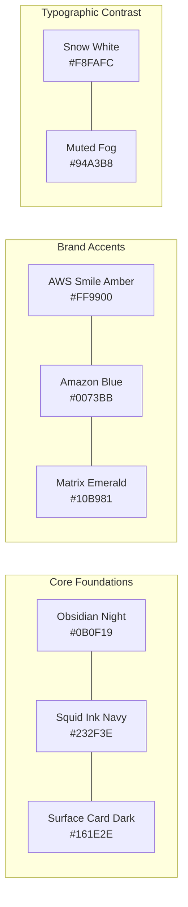

# BRAND GUIDELINES & MASTER ASSET REPOSITORY MAP
## Visual Identity Standards, Amazon Ember Typography & Repository Asset Inventory
**Location:** [`Website/01_BRAND_GUIDELINES_AND_ASSET_REPOSITORY_MAP.md`](file:///e:/AWS%20SBGL/Website/01_BRAND_GUIDELINES_AND_ASSET_REPOSITORY_MAP.md)  
**Parent Package:** AWS Student Builder Group (AWS SBGL) — SIST Chapter  
**Governing Standard:** Amazon Web Services Worldwide Community Brand Guidelines  
**Accountable Leads:** Rikish B (CCMO / Design Lead) & Viswanathan Ashok (Technical & Web Lead)  

---

## 1. Complete Asset Inventory with Exact Locations & Design Abstracts

Every creative and brand asset needed to construct the chapter website is hosted locally in this repository. Below is the definitive directory map with direct links and comprehensive design abstracts explaining each asset's semantic role.

```text
e:\AWS SBGL/
├── Leader Library/
│   ├── 00- Welcome _ Start Here/
│   │   └── AWS Student Builder Group Leader Handbook.pdf
│   ├── 01- Creative Assets _ Fonts, Icons, Etc_/
│   │   ├── AWS_StudentBuilderGroups_PPTTemplate_Final.pptx
│   │   ├── AWS_StudentBuilderGroups_PPTTemplate_Final.pdf
│   │   ├── Virtual background - Amber.png
│   │   ├── Fonts/Fonts/
│   │   │   ├── AmazonEmberDisplay_He.ttf
│   │   │   ├── AmazonEmberDisplay_Bd.ttf
│   │   │   ├── AmazonEmberDisplay_Md.ttf
│   │   │   ├── AmazonEmberDisplay_Rg.ttf
│   │   │   ├── AmazonEmberDisplay_Lt.ttf
│   │   │   ├── AmazonEmberMono_Bd.ttf
│   │   │   ├── AmazonEmberMono_Rg.ttf
│   │   │   ├── Amazon Ember Duospace Bold.ttf
│   │   │   └── Amazon Ember Duospace.ttf
│   │   ├── LOGO/
│   │   │   ├── AWS Student Builder Group_RGB_Program Icon_White.png
│   │   │   ├── AWS Student Builder Group_RGB_Program Icon_Blue (2).png
│   │   │   ├── AWS Student Builder Group_RGB_Program Icon_Grey 850.png
│   │   │   ├── AWS Student Builder Group_RGB_Program Icon_Magenta.png
│   │   │   ├── AWS Student Builder Group_RGB_Program Icon_Mint.png
│   │   │   └── AWS Student Builder Group_RGB_Program Icon_Purple.png
│   │   ├── Primary Brandmark/
│   │   │   ├── AWS Student Builder Group_RGB_Brandmark_White.png
│   │   │   ├── AWS Student Builder Group_RGB_Brandmark_Grey 850.png
│   │   │   ├── AWS Student Builder Group_RGB_Brandmark_Magenta.png
│   │   │   ├── AWS Student Builder Group_RGB_Brandmark_Mint.png
│   │   │   └── AWS Student Builder Group_RGB_Brandmark_Purple.png
│   │   └── Secodary Brandmark/
│   │       └── SVG-selected.zip
│   ├── 02- Publishing Articles _ Brief/
│   │   └── SBGL Publishing Articles Brief.pdf
│   └── 04- Event Planning _ Tools + Resources/
│       ├── AWS Student Builder Group Leader Event Checklist.pdf
│       └── AWS Student Builder Group Leader Event Toolkit.pdf
├── Attendee Feedback_qrcode_pulse.aws.png
├── masterz-QR-Code.png
├── SBGL Affiliation-Letter.pdf
└── References/
    ├── AWSSBG_FAC_001_2026.pdf
    └── AWSSBG_FAC_002_2026.pdf
```

---

### Detailed Asset Catalog & Semantic Abstracts

#### 1. Official Typeface Suite: Amazon Ember
* **Location:** [`Leader Library/01- Creative Assets _ Fonts, Icons, Etc_/Fonts/Fonts/`](file:///e:/AWS%20SBGL/Leader%20Library/01-%20Creative%20Assets%20_%20Fonts,%20Icons,%20Etc_/Fonts/Fonts)
* **Design Abstract:** Amazon Ember is the proprietary corporate typeface engineered by Dalton Maag for Amazon Web Services. It features high legibility across high-density terminal consoles, technical documentation, and ultra-wide display stages. It must be declared globally via CSS `@font-face` rules.
  * **[`AmazonEmberDisplay_He.ttf`](file:///e:/AWS%20SBGL/Leader%20Library/01-%20Creative%20Assets%20_%20Fonts,%20Icons,%20Etc_/Fonts/Fonts/AmazonEmberDisplay_He.ttf)** *(Weight: 900 / Heavy)*: The display heavy weight. Used exclusively for mega pitch headlines, display hero titles (H1), prize money counters (`₹1,75,000`), and countdown digit headers.
  * **[`AmazonEmberDisplay_Bd.ttf`](file:///e:/AWS%20SBGL/Leader%20Library/01-%20Creative%20Assets%20_%20Fonts,%20Icons,%20Etc_/Fonts/Fonts/AmazonEmberDisplay_Bd.ttf)** *(Weight: 700 / Bold)*: Standard section headings (H2), modal titles, navigation brand names, and primary card headlines.
  * **[`AmazonEmberDisplay_Md.ttf`](file:///e:/AWS%20SBGL/Leader%20Library/01-%20Creative%20Assets%20_%20Fonts,%20Icons,%20Etc_/Fonts/Fonts/AmazonEmberDisplay_Md.ttf)** *(Weight: 500 / Medium)*: Subheadings (H3), navigation links, button labels, and filter pills.
  * **[`AmazonEmberDisplay_Rg.ttf`](file:///e:/AWS%20SBGL/Leader%20Library/01-%20Creative%20Assets%20_%20Fonts,%20Icons,%20Etc_/Fonts/Fonts/AmazonEmberDisplay_Rg.ttf)** *(Weight: 400 / Regular)*: Standard body copy, explanatory event abstracts, curriculum descriptions, and FAQ answers.
  * **[`AmazonEmberDisplay_Lt.ttf`](file:///e:/AWS%20SBGL/Leader%20Library/01-%20Creative%20Assets%20_%20Fonts,%20Icons,%20Etc_/Fonts/Fonts/AmazonEmberDisplay_Lt.ttf)** *(Weight: 300 / Light)*: Fine-print captions, timestamp metadata, and secondary legal disclaimers.
  * **[`AmazonEmberMono_Bd.ttf`](file:///e:/AWS%20SBGL/Leader%20Library/01-%20Creative%20Assets%20_%20Fonts,%20Icons,%20Etc_/Fonts/Fonts/AmazonEmberMono_Bd.ttf)** & **[`AmazonEmberMono_Rg.ttf`](file:///e:/AWS%20SBGL/Leader%20Library/01-%20Creative%20Assets%20_%20Fonts,%20Icons,%20Etc_/Fonts/Fonts/AmazonEmberMono_Rg.ttf)** *(Monospace)*: Fixed-width code typeface. Used for AWS CLI terminal windows, JSON API snippets, Git commit hashes, team registration join codes (`KAIROS-T042`), and terminal badges.
  * **[`Amazon Ember Duospace Bold.ttf`](file:///e:/AWS%20SBGL/Leader%20Library/01-%20Creative%20Assets%20_%20Fonts,%20Icons,%20Etc_/Fonts/Fonts/Amazon%20Ember%20Duospace%20Bold.ttf)** & **[`Amazon Ember Duospace.ttf`](file:///e:/AWS%20SBGL/Leader%20Library/01-%20Creative%20Assets%20_%20Fonts,%20Icons,%20Etc_/Fonts/Fonts/Amazon%20Ember%20Duospace.ttf)** *(Duospace)*: Tabular alignment typeface. Ensures numbers line up vertically on live telemetry ribbons, scoreboards, and financial sponsorship tables without layout jitter.

---

#### 2. Primary Brandmarks (Horizontal Lockups)
* **Location:** [`Leader Library/01- Creative Assets _ Fonts, Icons, Etc_/Primary Brandmark/`](file:///e:/AWS%20SBGL/Leader%20Library/01-%20Creative%20Assets%20_%20Fonts,%20Icons,%20Etc_/Primary%20Brandmark)
* **Design Abstract:** The horizontal brandmark is the definitive signature of the program. It incorporates the "AWS Student Builder Group" wordmark balanced against the orange Amazon smile curve.
  * **[`AWS Student Builder Group_RGB_Brandmark_White.png`](file:///e:/AWS%20SBGL/Leader%20Library/01-%20Creative%20Assets%20_%20Fonts,%20Icons,%20Etc_/Primary%20Brandmark/AWS%20Student%20Builder%20Group_RGB_Brandmark_White.png)**: **Mandatory primary web asset**. Designed specifically for high contrast against dark canvases (Obsidian `#0B0F19` and Squid Ink `#232F3E`). Use in the global web header and sticky navbar.
  * **[`AWS Student Builder Group_RGB_Brandmark_Grey 850.png`](file:///e:/AWS%20SBGL/Leader%20Library/01-%20Creative%20Assets%20_%20Fonts,%20Icons,%20Etc_/Primary%20Brandmark/AWS%20Student%20Builder%20Group_RGB_Brandmark_Grey%20850.png)**: High-contrast dark version for white/light document modes, printable PDF certificates, and formal institutional proposals.
  * **Color Accent Variants (`Magenta.png`, `Mint.png`, `Purple.png`)**: Specialized campaign brandmarks. Mint is used for green tech and open-source initiatives; Magenta for women-in-tech campaigns (`#WomenInStudentBuilderGroups`); Purple for cloud gaming/AI tracks.

---

#### 3. Compact Program Icons / Badges
* **Location:** [`Leader Library/01- Creative Assets _ Fonts, Icons, Etc_/LOGO/`](file:///e:/AWS%20SBGL/Leader%20Library/01-%20Creative%20Assets%20_%20Fonts,%20Icons,%20Etc_/LOGO)
* **Design Abstract:** High-density square/circular badges designed for constrained digital environments where the full horizontal text brandmark would become illegible.
  * **[`AWS Student Builder Group_RGB_Program Icon_White.png`](file:///e:/AWS%20SBGL/Leader%20Library/01-%20Creative%20Assets%20_%20Fonts,%20Icons,%20Etc_/LOGO/AWS%20Student%20Builder%20Group_RGB_Program%20Icon_White.png)**: Use for the browser favicon, mobile browser home-screen icons, social profile pictures, and floating feedback widgets.
  * **[`AWS Student Builder Group_RGB_Program Icon_Blue (2).png`](file:///e:/AWS%20SBGL/Leader%20Library/01-%20Creative%20Assets%20_%20Fonts,%20Icons,%20Etc_/LOGO/AWS%20Student%20Builder%20Group_RGB_Program%20Icon_Blue%20(2).png)**: Official Amazon Blue background badge for verified partner showcases, Discord community servers, and GitHub organization avatars.

---

#### 4. Vector SVG Assets
* **Location:** [`Leader Library/01- Creative Assets _ Fonts, Icons, Etc_/Secodary Brandmark/SVG-selected.zip`](file:///e:/AWS%20SBGL/Leader%20Library/01-%20Creative%20Assets%20_%20Fonts,%20Icons,%20Etc_/Secodary%20Brandmark/SVG-selected.zip)
* **Design Abstract:** Scalable vector format versions of all official lockups. When building responsive SVG web components or rendering crisp assets on 4K/8K stage LED monitors (e.g., during Kairos 2027), extract and link these SVGs to ensure zero pixelation at any scale.

---

#### 5. Master Presentation Decks & Virtual Backgrounds
* **Master Slide Presentation:** [`AWS_StudentBuilderGroups_PPTTemplate_Final.pptx`](file:///e:/AWS%20SBGL/Leader%20Library/01-%20Creative%20Assets%20_%20Fonts,%20Icons,%20Etc_/AWS_StudentBuilderGroups_PPTTemplate_Final.pptx) & [`PDF`](file:///e:/AWS%20SBGL/Leader%20Library/01-%20Creative%20Assets%20_%20Fonts,%20Icons,%20Etc_/AWS_StudentBuilderGroups_PPTTemplate_Final.pdf)
  * **Design Abstract:** 14-slide master template setting the visual benchmark for chapter pitch decks, workshop slides, and sponsor presentations. Demonstrates layout ratios, obsidian backgrounds, and amber badge callouts.
* **Amber Virtual Background:** [`Virtual background - Amber.png`](file:///e:/AWS%20SBGL/Leader%20Library/01-%20Creative%20Assets%20_%20Fonts,%20Icons,%20Etc_/Virtual%20background%20-%20Amber.png)
  * **Design Abstract:** High-resolution 1920x1080 ambient backdrop featuring glowing amber light curves. Used as the atmospheric backdrop for webinar streams, online qualifier pitch sessions, and YouTube workshop thumbnails.

---

#### 6. Official QR Codes & Feedback Gateway
* **Pulse Attendee Feedback QR:** [`Attendee Feedback_qrcode_pulse.aws.png`](file:///e:/AWS%20SBGL/Attendee%20Feedback_qrcode_pulse.aws.png)
  * **Design Abstract:** Official scannable QR code directing attendees to the global `pulse.aws` feedback survey. Mandatory for the `/csat` route and post-event slide displays.
* **President Profile QR:** [`masterz-QR-Code.png`](file:///e:/AWS%20SBGL/masterz-QR-Code.png)
  * **Design Abstract:** Digital business card QR linking directly to President Thenappan T (MasterZ) for rapid leadership connection and verified accreditation.

---

#### 7. Institutional Credentials & Legal Authority
* **Official Affiliation Letter:** [`SBGL Affiliation-Letter.pdf`](file:///e:/AWS%20SBGL/SBGL%20Affiliation-Letter.pdf)
  * **Design Abstract:** Global charter confirmation issued from Amazon Web Services (Seattle, WA) establishing the SIST chapter under President Thenappan T. Essential proof-of-work asset for the `/about` and `/pitch` sections.
* **Faculty Coordinator Appointments:** [`AWSSBG_FAC_001_2026.pdf`](file:///e:/AWS%20SBGL/References/AWSSBG_FAC_001_2026.pdf) & [`AWSSBG_FAC_002_2026.pdf`](file:///e:/AWS%20SBGL/References/AWSSBG_FAC_002_2026.pdf)
  * **Design Abstract:** Official university appointment orders for Dr. K. Ashok Kumar and Dr. Balapriya .S. Proves institutional backing from the Department of Computer Science and Engineering.

---

## 2. Official Color System & CSS Design Tokens

The chapter website utilizes an ultra-premium Obsidian-Amber dark mode palette calibrated for high developer engagement, cognitive focus, and aesthetic authority:



### Color Token Reference Table

| Token Name | Hex Code | RGB | HSL | Semantic Application |
| :--- | :---: | :---: | :---: | :--- |
| **AWS Smile Amber** | `#FF9900` | `255, 153, 0` | `36°, 100%, 50%` | Primary brand accent, primary CTA button glow, active states, winner medals, key telemetry numbers. |
| **Squid Ink Navy** | `#232F3E` | `35, 47, 62` | `213°, 28%, 19%` | Primary header canvas, secondary card containers, table headers, dark surfaces. |
| **Obsidian Night** | `#0B0F19` | `11, 15, 25` | `223°, 39%, 7%` | Master background canvas across all pages, terminal backgrounds, full-bleed modals. |
| **Surface Card Dark** | `#161E2E` | `22, 30, 46` | `220°, 35%, 13%` | Glassmorphic card backdrops (`rgba(22, 30, 46, 0.75)`), form containers, dialog modals. |
| **Cyber Slate** | `#1E293B` | `30, 41, 59` | `217°, 33%, 17%` | Elevated card surfaces, card borders (`rgba(30, 41, 59, 0.8)`), dropdown menus. |
| **Amazon Blue** | `#0073BB` | `0, 115, 187` | `203°, 100%, 37%` | Interactive hyperlinks, cloud certification badges, secondary feature tags. |
| **Matrix Emerald** | `#10B981` | `16, 185, 129` | `160°, 84%, 39%` | Verified Meetup RSVP indicator, live event status beacons, 100% free badge pills. |
| **Snow White** | `#F8FAFC` | `248, 250, 252`| `210°, 40%, 98%` | Primary display headlines, high-contrast typography, white brandmark text. |
| **Muted Fog** | `#94A3B8` | `148, 163, 184`| `215°, 20%, 65%` | Secondary body text, timestamps, inactive borders, footer links. |

---

## 3. Logo Clear-Space & Integrity Specifications

To protect the institutional authority of the Amazon Web Services brand, the web design team must enforce strict clear-space buffers around all brandmark instances.

### Clear-Space Formula:
The mandatory exclusion zone surrounding the brandmark is defined as **$X$**, where **$X$ is exactly equal to the height of the capital letter "A" in the AWS wordmark**:

```text
┌────────────────────────────────────────────────────────────────────────┐
│                               [ X Buffer ]                             │
│   [ X ]   ┌────────────────────────────────────────────────┐   [ X ]   │
│           │   AWS Student Builder Group                    │           │
│           │                [AWS Smile Curve]               │           │
│   [ X ]   └────────────────────────────────────────────────┘   [ X ]   │
│                               [ X Buffer ]                             │
└────────────────────────────────────────────────────────────────────────┘
Buffer X = Height of the capital letter "A" in the AWS Brandmark
```

### Mandatory Rules of Logo Integrity:
1. **Minimum Digital Size**: The primary horizontal brandmark must never be rendered smaller than **120 pixels in width** on any web display.
2. **Smile Curve Integrity**: The AWS smile curve must **never be recolored**. It must strictly remain official AWS Smile Amber (`#FF9900`) or solid white on monochrome dark surfaces.
3. **No Special Effects**: Never apply drop shadows, outer glows, 3D extrusions, gradients, or rotations to the logo lockup.
4. **No Encapsulation**: Never enclose the logo in an arbitrary circular or rectangular container that violates the clear-space boundary.
5. **No Independent Modification**: Never detach the smile curve from the wordmark or combine it with unapproved campus crests.

---

## 4. Mandatory Legal Disclaimers & Official Links

### Official Footer Disclaimer (Mandatory on Every Page)
Every web page in the production deployment must include the following legal statement in the global footer:

> **"AWS Student Builder Group Sathyabama is an independent student organization supported by the AWS Student Builder Groups program. Amazon Web Services, AWS, and the AWS logo are trademarks of Amazon.com, Inc. or its affiliates."**

### Official Digital Touchpoint Manifest:
* **Official Instagram**: [`https://www.instagram.com/aws.studentbuildergroup_sist/`](https://www.instagram.com/aws.studentbuildergroup_sist/) (Handle: `@aws.studentbuildergroup_sist`)
* **Official LinkedIn**: [`https://www.linkedin.com/company/aws-sbg-sist/`](https://www.linkedin.com/company/aws-sbg-sist/) (Identifier: `aws-sbg-sist`)
* **Official Meetup Chapter**: [`https://meetup.com/aws-student-builder-group-sist`](https://meetup.com/aws-student-builder-group-sist)
* **Official AWS Builder Center**: [`https://s12d.com/students`](https://s12d.com/students)
* **Official Pulse Feedback**: `https://pulse.aws`
* **Official Email**: `sistawscc@gmail.com`
* **Official Asset Generator Tool**: `https://aws-version-3--assets-generator.netlify.app/` (Password: `lets-make-assets`)
