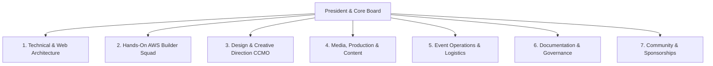

# WEBSITE SECTIONS & PAGE ARCHITECTURE MASTER BLUEPRINT
## Route Specifications, Component Wireframes & Content Taxonomy
**Location:** [`Website/02_WEBSITE_SECTIONS_AND_PAGE_ARCHITECTURE.md`](file:///e:/AWS%20SBGL/Website/02_WEBSITE_SECTIONS_AND_PAGE_ARCHITECTURE.md)  
**Parent Chapter:** AWS Student Builder Group (AWS SBGL) — SIST Chapter  
**Target Domain:** `https://sbg-sist.in` / `https://kairos.sathyabama.ac.in`  
**Governing Lead:** Viswanathan Ashok (Technical & Web Lead) & Thenappan T (President)  

---

## 1. Master Route Directory & Information Architecture

The website is architected as an enterprise multi-page portal structured for pitch-level impact, high developer conversion, and full institutional transparency.

```text
https://sbg-sist.in/
├── /                              # Grand Pitch Hero, Live Telemetry & Flagship Overview
├── /about                         # Chapter Charter, Global Seattle Affiliation & Department Heritage
├── /events                        # [ALL-TIME ARCHIVE] Master Historical Timeline of All Past Events
├── /events/upcoming               # [ACTIVE PORTAL] Live Countdown, Registration & Round Schedules
├── /team                          # [ANNUAL ROSTERS] Default view for Current Batch (2026–2027)
├── /team/[year]                   # Dynamic Annual Archives (e.g., /team/2026-2027, /team/2025-2026)
├── /domains                       # [SPECIALIZED DOMAINS] Deep-Dive into 7 Functional Squads
├── /projects                      # [BUILDER SHOWCASE] Student Systems, Cloud Architectures & GitHub Repos
├── /resources                     # AWS Learning Toolkits (Skill Builder, Cloud Quest, Bedrock Starter Kits)
├── /articles                      # AWS Builder Center Publications (s12d.com/students sync)
├── /sponsors                      # Corporate Partnership Deck, Tier Matrix & Prospectus Download
├── /csat                          # Official Pulse Survey Feedback & Attendee Digital Badges
└── /join                          # Freshers & Student Builder Recruitment Intake Engine
```

---

## 2. Granular Page-by-Page Specifications

### Page 1: Grand Pitch Landing Page (`/`)

The homepage serves as the primary pitch deck for all external stakeholders (AWS, corporate sponsors, faculty, freshers). It must be visually arresting, dark-mode first, and alive with ambient micro-interactions.

```text
┌────────────────────────────────────────────────────────────────────────┐
│ Global Navigation Bar (Brandmark · Nav Links · Socials · Builder CTA)   │
├────────────────────────────────────────────────────────────────────────┤
│ Hero Section:                                                          │
│   [🟢 Official AWS Student Community · 600+ Campuses Worldwide]         │
│   "We Don't Just Learn the Cloud. We Engineer the Future."             │
│   Subhead: Peer-driven AWS cloud architecture, agentic AI & devops.    │
│   [Explore Upcoming Events] (Amber)    [Download Club Pitch Deck]      │
│   Live Telemetry Strip: 1,200+ Builders · 6 Events/Yr · ₹1.75L Prizes  │
├────────────────────────────────────────────────────────────────────────┤
│ Value Proposition Grid (The 3 Core Pillars: Learn · Build · Connect)   │
├────────────────────────────────────────────────────────────────────────┤
│ Featured Active Event Spotlight (Kairos 2027 / Next Flagship)          │
├────────────────────────────────────────────────────────────────────────┤
│ Elite Project Sneak-Peek (Agentic AI & Serverless IoT)                 │
├────────────────────────────────────────────────────────────────────────┤
│ Corporate Sponsor Showcase & Industry Partner Wall                     │
├────────────────────────────────────────────────────────────────────────┤
│ Community Call to Action (Create Builder ID & Join Meetup)             │
├────────────────────────────────────────────────────────────────────────┤
│ Global Compliant Footer (Mandatory Legal Disclaimer & Social Links)    │
└────────────────────────────────────────────────────────────────────────┘
```

#### Key Sections on Homepage:
1. **Hero Section with Dynamic Telemetry Ribbon**:
   - High-contrast headline rendered in `Amazon Ember Display Heavy` (`#FFFFFF`).
   - Ambient glowing mesh gradient in Obsidian Dark (`#0B0F19`) and AWS Smile Amber (`#FF9900`).
   - Live telemetry counters (using `Amazon Ember Duospace`):
     - `1,200+ Active Builders`
     - `6 Flagship Events/Year`
     - `100% Free Access (₹0 Fee)`
     - `50+ Certified Cloud Practitioners`
     - `$50,000+ Distributed Cloud Credits`
2. **The 3 Core Pillars (Chapter Mission)**:
   - **Learn**: Systematic curriculum from foundational cloud concepts to advanced solutions architecture.
   - **Build**: Live production engineering in the Elite Production Lab deploying serverless, AI, and containers.
   - **Connect**: Direct access to AWS Principal Advocates, corporate hiring pipelines, and global leader cohorts.
3. **Featured Event Billboard**: Highlights the upcoming major activation (e.g. Kairos 2027) with live registration status.
4. **Verified Proof-of-Work Grid**: Interactive cards displaying student certifications and open-source contributions.

---

### Page 2: About the Chapter & Institutional Heritage (`/about`)

Presents the formal credentials, legal charter, and academic backing of the chapter.

#### Key Sections:
1. **Global Seattle Affiliation**:
   - Digital verification badge linked directly to [`SBGL Affiliation-Letter.pdf`](file:///e:/AWS%20SBGL/SBGL%20Affiliation-Letter.pdf) from Amazon Web Services (Seattle, WA).
   - Highlighting the chapter's place among 600+ global university builder groups.
2. **Sathyabama University Heritage**:
   - Host institution profile: School of Computing, Department of Computer Science and Engineering.
   - Formal appointment of Faculty Coordinators: **Dr. K. Ashok Kumar** and **Dr. Balapriya .S** (linking to [`AWSSBG_FAC_001_2026.pdf`](file:///e:/AWS%20SBGL/References/AWSSBG_FAC_001_2026.pdf) and [`AWSSBG_FAC_002_2026.pdf`](file:///e:/AWS%20SBGL/References/AWSSBG_FAC_002_2026.pdf)).
3. **Chapter Governance Charter**:
   - Highlights the 10-page integrated governance framework ([`AWS_SBG_Club_Charter.pdf`](file:///e:/AWS%20SBGL/Team%2026-27/AWS_SBG_Club_Charter.pdf)).
   - Explains the merit-based, non-commercial, strictly academic structure.

---

### Page 3: Master All-Time Events Archive (`/events`)

A comprehensive, chronological repository of **all events the club organizes all the time**. This serves as the chapter's permanent digital historical record.

#### Feature Matrix:
* **Interactive Filter Tabs**: `All Events`, `Flagship Hackathons`, `Certification Bootcamps`, `Workshops & Labs`, `Tech Talks`.
* **Search & Year Filter**: Rapidly filter by academic year (`2026–2027`, `2025–2026`).

#### Event Card Data Model:
```typescript
interface EventArchiveItem {
  id: string;
  title: string;
  category: "Hackathon" | "Certification" | "Workshop" | "Orientation";
  date: string;
  academicYear: string;
  venue: string;
  attendeeCount: number;
  bannerImage: string;
  synopsis: string;
  speakers: Array<{ name: string; title: string; company: string }>;
  deliverables: {
    reportPdfUrl: string;
    photoGalleryUrl: string;
    builderCenterArticleUrl?: string;
  };
  metrics: {
    badgesIssued: number;
    csatScore: number;
    projectsDeployed: number;
  };
}
```

#### Chronicled Chapter Events in Archive:
1. **AWS Launchpad 2026** (July 14, 2026):
   - Inaugural orientation, Samuel Asirvatham Rajarathinam & Pooja Srikanth keynotes, Agentic AI with AWS Strands SDK, 350+ attendees.
   - Links to [`AWS Launchpad ARTICLE.md`](file:///e:/AWS%20SBGL/Events/AWS%20Launchpad/AWS%20Launchpad%20ARTICLE.md) and PDF report.
2. **Weeklong AWS CCP Certification Workshop** (August 2026):
   - 6-day intensive domain curriculum, Cloud Fundamentals to Well-Architected Framework, 100% exam vouchers.
   - Links to [`AWS Weeklong Workshop Participant Guide.pdf`](file:///e:/AWS%20SBGL/Events/Weeklong%20Workshop/AWS%20Weeklong%20Workshop%20Participant%20Guide.pdf).
3. **KAIROS 2027 (Grand Edition)** (January 22–24, 2027):
   - 48-Hour National Hackathon, 2,000+ applicants, ₹1,75,000 cash prizes, 5 enterprise tracks.
   - Links to [`hackathon-master-plan.md`](file:///e:/AWS%20SBGL/Events/Kairos/hackathon-master-plan.md).
4. **Annual 6-Event Flagship Series**:
   - Detailed modules for *Cloud Zero*, *Cloud Forge*, *Startup Synapse*, *Exam Engine*, *Zeus Core*, and *Autonomous Operations*.

---

### Page 4: Active & Upcoming Events Live Portal (`/events/upcoming`)

The dynamic registration engine and operational mission control for currently active or upcoming events.

#### Key Features:
1. **Down-to-the-Second Countdown Timer**: Rendered in `Amazon Ember Mono Bold`, ticking down to event kickoff.
2. **Dual-Registration Funnel (100% Free / ₹0 Guarantee)**:
   - **Step 1**: Join & RSVP on official Meetup.com chapter ([`meetup.com/aws-student-builder-group-sist`](https://meetup.com/aws-student-builder-group-sist)).
   - **Step 2**: Create universal AWS Builder ID ([`s12d.com/students`](https://s12d.com/students)).
   - **Step 3**: Submit team roster with verified Meetup Profile URLs.
3. **Interactive 48-Hour Schedule Matrix**:
   - Filterable timeline: Checkpoint gates, food drops, mentor clinics, stage keynotes.
4. **Live Hacker Dashboard (During Event)**:
   - WiFi SSID & captive portal credentials, real-time mentor queue, Git commit velocity tracker.

---

### Page 5: Annual Core Team Rosters (`/team` & `/team/[year]`)

Dedicated recognition portal celebrating the student leadership and executive board across every academic year.

#### Academic Year Switcher:
* **`/team/2026-2027` (Current Active Board)**:
  * **President**: Thenappan T (MasterZ) — Reg: `44110855`
  * **Builder Team Lead**: Viswanathan Ashok
  * **Technical Team Lead**: Shanmugapriyan
  * **Events and Management Team Lead**: Nangaiyar M
  * **Media Team Lead**: Caroline Mary McPherson
  * **Media Team Co-Lead**: Harshith Raj S
  * **Documentation Team Lead**: Hemavarshine S
  * **Faculty Coordinators**: Dr. K. Ashok Kumar & Dr. Balapriya .S
* **`/team/2025-2026` (Founding Leadership Archive)**:
  * Historical record of the initial founding cohort and chapter establishment.
* **`/team/hall-of-fame`**:
  * Alumni hall of fame honoring builders who secured AWS certifications, won national hackathons, or joined top tier cloud employers.

#### Leader Profile Card Structure:
* High-res portrait with rounded glass border.
* Full Name, Academic Year, and Register Number.
* Official Domain Mandate and primary deliverables.
* **Verified AWS Badges**: AWS Certified Cloud Practitioner, Solutions Architect Associate.
* Social Connect: LinkedIn, GitHub, and Personal Portfolio.

---

### Page 6: Functional Domains Deep-Dive (`/domains`)

An in-depth explanation of the **7 specialized functional domains** operating within the chapter. Crucial for pitching club structure to sponsors and recruiting new junior talent.



#### Detailed Domain Profiles:
1. **Technical & Web Architecture** *(Lead: Viswanathan Ashok)*:
   - Mandate: Full-stack engineering, production Next.js platforms, cloud deployment automation on AWS (S3, CloudFront, Route 53, Lambda).
   - Tech Stack: TypeScript, Next.js, Tailwind/Vanilla CSS, PostgreSQL, AWS CDK.
2. **Hands-On AWS Builder Squad** *(Lead: Shanmugapriyan S)*:
   - Mandate: Designing hands-on cloud labs, orchestrating AWS Skill Builder tournaments, architecting Bedrock GenAI workshops.
   - Tools: AWS Management Console, AWS CLI, CloudFormation, SageMaker, Bedrock.
3. **Design & Creative Direction (CCMO)** *(Lead: Rikish B)*:
   - Mandate: Shaping visual identity, 3D motion graphics, stage LED visuals, custom merchandise (hoodies, metal NFC badges).
   - Tools: Figma, Blender, Adobe Illustrator, After Effects.
4. **Media, Production & Storytelling** *(Lead: Caroline Mary McPherson)*:
   - Mandate: Video production, event photography, Instagram Reels, speaker spotlight interviews, YouTube recaps.
   - Channels: `@awssbg_sist`, YouTube, LinkedIn.
5. **Event Operations & Logistics** *(Lead: Nangaiyar M)*:
   - Mandate: Auditorium requisitions, AV engineering, catering coordination, crowd safety, run-of-show synchronization.
6. **Documentation, Reporting & Governance** *(Lead: Hemavarshine S)*:
   - Mandate: Official letter drafting, institutional permissions, post-event reports, faculty clearance tracking, Git repository archival.
7. **Community Engagement & Sponsorship Outreach** *(Lead: Harshith Raj S)*:
   - Mandate: Corporate sponsor pitching, fundraising outreach, Meetup.com community engagement, member support.

---

### Page 7: Engineering Projects & Builder Showcase (`/projects`)

Showcases tangible engineering systems and proof-of-work deployed by the student builders.

#### Featured Systems:
1. **Strands AI Agent Orchestrator**: Multi-agent automation system deployed on AWS Bedrock using Claude 3.5 Sonnet and custom Python tooling.
2. **Kairos 2027 Hackathon Engine**: High-concurrency event portal with live commit velocity tracking, automated team join codes, and Meetup profile verification.
3. **Serverless IoT Campus Telemetry**: Real-time sensor pipeline running on AWS IoT Core, Lambda, and DynamoDB for smart building telemetry.
4. **Automated Pulse CSAT Microservice**: Serverless ingestion engine parsing `pulse.aws` attendee responses and generating instant CSAT reports.

---

### Page 8: Student Learning Hub & Toolkits (`/resources`)

Direct gateway to turnkey AWS learning resources from `Leader Library/04- Event Planning _ Tools + Resources/`:
* **AWS Skill Builder**: Direct links to 400+ free cloud courses.
* **AWS Cloud Quest**: Cloud Practitioner tournament mode game for gamified learning.
* **Bedrock Generative AI Starter Kits**: Pre-configured Python and TypeScript starter repos for building on foundation models.
* **Storytelling for Career Readiness**: 2-hour interactive module helping students articulate cloud projects in tech interviews.

---

### Page 9: AWS Builder Center Articles (`/articles`)

Showcase of student-authored architectural deep dives published on [`s12d.com/students`](https://s12d.com/students). Direct mechanism for students to build public proof of work.

---

### Page 10: Corporate Sponsors & Campus Partners (`/sponsors`)

Enterprise pitch deck summarizing sponsorship benefits:
* **Tier Matrix**:
  - Title Sponsor: `₹1,25,000` (Headline stage branding, keynote slot, resume access).
  - Powered-By Sponsor: `₹70,000` (Track naming rights, VIP judging seat).
  - Track & Community Sponsors: `₹35,000` / `₹15,000`.
* **Download Prospectus**: Links to ready-to-deploy PDF kits adapted from [`ANTI-Help/10_HACKATHON_SPONSORSHIP_LETTERS_AND_OUTREACH_KIT.md`](file:///e:/AWS%20SBGL/ANTI-Help/10_HACKATHON_SPONSORSHIP_LETTERS_AND_OUTREACH_KIT.md).

---

### Page 11: Attendee Feedback & CSAT Telemetry (`/csat`)

* Embeds the official **Pulse Feedback Survey** via [`Attendee Feedback_qrcode_pulse.aws.png`](file:///e:/AWS%20SBGL/Attendee%20Feedback_qrcode_pulse.aws.png) and URL `pulse.aws`.
* Explains how attendees can verify attendance and claim official AWS digital event badges.

---

## 3. Global Header & Compliant Footer Specifications

### Global Header Component:
* **Sticky Positioning**: `top: 0; backdrop-filter: blur(16px); background: rgba(11, 15, 25, 0.85);`
* **Left**: White Primary Brandmark with mandatory $1\times A$ clear space.
* **Center Navigation**: `Home`, `About`, `Events` (dropdown: Archive & Live), `Team` (dropdown: 2026–27 & Hall of Fame), `Domains`, `Projects`, `Resources`.
* **Right Social Icons**:
  - Instagram: [`@aws.studentbuildergroup_sist`](https://www.instagram.com/aws.studentbuildergroup_sist/)
  - LinkedIn: [`aws-sbg-sist`](https://www.linkedin.com/company/aws-sbg-sist/)
  - Meetup: [`aws-student-builder-group-sist`](https://meetup.com/aws-student-builder-group-sist)
  - Builder Center: [`s12d.com/students`](https://s12d.com/students)
* **Action CTA**: Glowing Amber button: `Create Builder ID`.

### Compliant Footer Component:
* **Mandatory Trademark Disclaimer**:
  > *"AWS Student Builder Group Sathyabama is an independent student organization supported by the AWS Student Builder Groups program. Amazon Web Services, AWS, and the AWS logo are trademarks of Amazon.com, Inc. or its affiliates."*
* **Contact Block**:
  - Email: `sistawscc@gmail.com`
  - President / SBGL: Thenappan T (`thenappanmasterz1311@gmail.com` · `+91 6381801640`)
  - Address: Department of Computer Science & Engineering, Sathyabama Institute of Science and Technology, Jeppiaar Nagar, Chennai 600119.
* **Quick Links**: Sitemap, Code of Conduct, Faculty Advisors, GitHub Repo.
