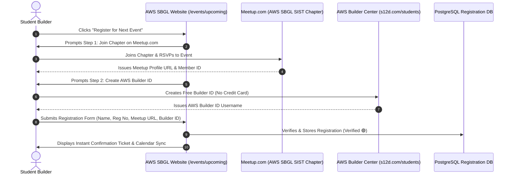

# AWS GUIDELINES VS. LEGACY STANDARDS COMPARISON MATRIX
## Legacy Chapter Practices vs. Official AWS Global Program Directives
**Location:** [`Website/03_AWS_GUIDELINES_VS_LEGACY_STANDARDS_MATRIX.md`](file:///e:/AWS%20SBGL/Website/03_AWS_GUIDELINES_VS_LEGACY_STANDARDS_MATRIX.md)  
**Parent Chapter:** AWS Student Builder Group (AWS SBGL) — SIST Chapter  
**Governing Standard:** AWS Student Builder Group Leader Handbook (Seattle, WA)  
**Auditing Lead:** Thenappan T (President & SBGL) & Hemavarshine S (Documentation Lead)  

---

## 1. Executive Summary & Regulatory Context

Student developer organizations frequently accumulate informal habits, unofficial visual marks, and fragmented registration workflows that violate corporate trademark policies. 

As an officially recognized chapter under the global **AWS Student Builder Groups (SBGL)** program, our web platform must maintain **100% compliance** with Amazon Web Services global governance. 

This document contrasts **Legacy Chapter Habits** (which are strictly deprecated) with **Official AWS Directives** (which are mandatory across all web pages, event microsites, and promotional materials).

---

## 2. Comprehensive Comparative Matrix

| Dimension | Legacy Chapter Habits (To Deprecate) | Official AWS SBGL Global Directives (Mandatory) | Compliance Risk Level |
| :--- | :--- | :--- | :---: |
| **1. Official Entity Naming** | Calling the organization "AWS Club", "Amazon Student Club", "AWS Chapter SIST", or "AWS Student Branch". | **"AWS Student Builder Group — SIST Chapter"** (Short form: `AWS SBGL SIST`). Must always emphasize that it is an independent student organization supported by AWS. | 🔴 High (Trademark Infringement) |
| **2. Corporate Representation** | Implying that the club or its leaders are internal employees, corporate spokespeople, or official representatives of Amazon.com, Inc. | Must clearly state in all copy that leaders are **student volunteers** operating an autonomous campus group supported by the global SBGL program. | 🔴 High (Legal Representation) |
| **3. Logo & Brandmark** | Using the corporate Amazon smile logo standalone; using unapproved icons; recoloring the smile curve to blue or green. | **Strictly use the official "AWS Student Builder Group" primary brandmark** ([`Leader Library/.../Primary Brandmark/`](file:///e:/AWS%20SBGL/Leader%20Library/01-%20Creative%20Assets%20_%20Fonts,%20Icons,%20Etc_/Primary%20Brandmark)). Smile curve must remain Amber (`#FF9900`) or White. | 🔴 High (Brand Guidelines Breach) |
| **4. Logo Clear-Space** | Placing text, campus logos, or graphic shapes immediately adjacent to the logo with no padding. | **Mandatory $1\times A$ Clear-Space Buffer** on all four sides (equal to the height of the capital letter "A" in the AWS wordmark). Minimum width: 120px digital. | 🟡 Medium (Aesthetic Violation) |
| **5. Mandatory Legal Disclaimer** | Omitting disclaimers, or placing vague mentions only on the contact page. | **Mandatory on every single web page footer**: *"AWS Student Builder Group Sathyabama is an independent student organization supported by the AWS Student Builder Groups program. Amazon Web Services, AWS, and the AWS logo are trademarks of Amazon.com, Inc. or its affiliates."* | 🔴 High (Mandatory Legal Directive) |
| **6. Typography System** | Using system default fonts (Arial, Times New Roman, Calibri) or trendy third-party fonts (Syne, Outfit, Roboto) for everything. | **Official Amazon Ember Font Suite** ([`Leader Library/.../Fonts/`](file:///e:/AWS%20SBGL/Leader%20Library/01-%20Creative%20Assets%20_%20Fonts,%20Icons,%20Etc_/Fonts/Fonts)): Ember Display for headings, Ember Regular for body, Ember Mono for code/telemetry, Ember Duospace for tables. | 🟡 Medium (Visual Identity Inconsistency) |
| **7. Event Monetization & Ticketing** | Charging registration fees, selling event tickets, or using commercial ticketing payment gateways. | **100% FREE — ZERO ENTRY FEE (₹0)**. All workshops, hackathons, and training boot camps must be completely free for attendees. Paid paywalls are strictly forbidden. | 🔴 High (Charter Revocation Risk) |
| **8. Registration Workflow** | Solely using standalone Google Forms with no ecosystem connection. | **Meetup-First Dual Registration Funnel**: Attendees must RSVP via the official Meetup chapter ([`meetup.com/aws-student-builder-group-sist`](https://meetup.com/aws-student-builder-group-sist)) and create an **AWS Builder ID** ([`s12d.com/students`](https://s12d.com/students)). | 🔴 High (Reporting Metric Failure) |
| **9. Attendee Feedback & CSAT** | Sending post-event Google Forms days later or skipping feedback collection entirely. | **Official Pulse Feedback (`pulse.aws`)**: Must project the official QR code ([`Attendee Feedback_qrcode_pulse.aws.png`](file:///e:/AWS%20SBGL/Attendee%20Feedback_qrcode_pulse.aws.png)), dedicate 3 minutes before session close, and report metrics within 14 days. | 🔴 High (Program Health Requirement) |
| **10. Social Media Co-Branding** | Creating ad-hoc flyer graphics with arbitrary fonts and unapproved color gradients. | **Official Brand Asset Generator**: Graphics must be generated via `https://aws-version-3--assets-generator.netlify.app/` (password: `lets-make-assets`) using mandatory hashtag `#AWSsbgl`. | 🟡 Medium (Brand Governance) |
| **11. Technical Publishing** | Publishing articles solely on external student Medium accounts or personal blogs. | **AWS Builder Center First**: Student tutorials and architecture deep dives must be published on the official **AWS Builder Center** to accrue chapter points and swag vouchers. | 🟢 Low (Missed Incentive Opportunity) |
| **12. Operational Reporting Cadence** | Informal operations with no scheduled communication with Amazon AWS. | **Monthly Check-In Form & Slack Engagement**: Leader must file monthly reports by the final calendar day and participate in `#sbgl-announcements`. Minimum 6 official events per year. | 🔴 High (Charter Governance) |

---

## 3. Deep-Dive on Critical Architectural Directives

### 1. Naming & Institutional Voice
* **Prohibited Phrases**:
  - ❌ *"Welcome to the official Amazon AWS Club at Sathyabama."*
  - ❌ *"Join AWS SIST Chapter to work for Amazon Web Services."*
  - ❌ *"Official AWS Certification Exam Center of Sathyabama."*
* **Approved Phrases**:
  - ✅ *"AWS Student Builder Group — SIST Chapter is an autonomous student engineering community supported by the global AWS Student Builder Groups program."*
  - ✅ *"Learn, build, and connect on the AWS Cloud through peer-driven workshops and hands-on production labs."*

---

### 2. The 100% Free Entry Fee Guarantee

Per Page 18 of the *AWS Student Builder Group Leader Handbook*:
> "Events organized by AWS Student Builder Groups must remain radical accessible and completely free for all participating students. No leader or chapter may charge an admission fee, ticket charge, or commercial paywall to attend official AWS Student Builder Group sessions."

#### Web Implementation Rules:
1. Every event registration button must explicitly include a subtitle or badge: `100% Free · Zero Entry Fee · Sponsored by AWS SBGL`.
2. The registration form API must never accept credit card numbers, UPI payment screenshots, or bank transaction IDs.
3. Hackathon prize pools (e.g. Kairos 2027 ₹1,75,000 cash) must be funded exclusively through verified corporate sponsorships and university grants, never from student entry fees.

---

### 3. Dual-Registration Architecture: Meetup + Builder Center

The website registration system must bridge two core digital ecosystems:

---

## 4. Web Lead Audit Checklist for Production Release

Before publishing any release of `https://sbg-sist.in` or `https://kairos.sathyabama.ac.in`, the Web Lead (Viswanathan Ashok) must sign off on this 10-point checklist:

- [ ] **1. Exact Naming Check**: "AWS Student Builder Group — SIST Chapter" used everywhere; zero instances of "AWS Club".
- [ ] **2. Footer Disclaimer Check**: Mandatory trademark disclaimer present on every single route footer.
- [ ] **3. Logo Clear-Space Check**: $1\times A$ clear space maintained on desktop, tablet, and mobile breakpoints.
- [ ] **4. Typography Check**: Amazon Ember Display, Regular, Mono, and Duospace properly linked via `@font-face`.
- [ ] **5. Zero Fee Verification**: All registration forms confirm 100% free participation with no payment triggers.
- [ ] **6. Meetup Integration Check**: Event buttons link directly to [`meetup.com/aws-student-builder-group-sist`](https://meetup.com/aws-student-builder-group-sist).
- [ ] **7. Builder Center Check**: Builder ID onboarding links to [`s12d.com/students`](https://s12d.com/students).
- [ ] **8. CSAT Gateway Check**: Feedback portal links to `pulse.aws` with the official QR code displayed.
- [ ] **9. Social Media Handle Check**: Instagram correctly links to [`@aws.studentbuildergroup_sist`](https://www.instagram.com/aws.studentbuildergroup_sist/) and LinkedIn to `aws-sbg-sist`.
- [ ] **10. Sathyabama Affiliation Check**: CSE Department and Faculty Mentors (Dr. K. Ashok Kumar & Dr. Balapriya .S) credited.
