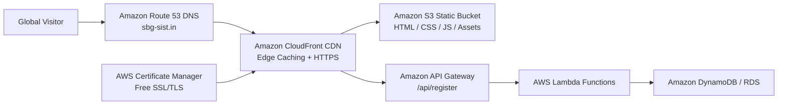

# FRONTEND TECH STACK & AWS SERVERLESS DEPLOYMENT GUIDE
## Framework Architecture, Web Performance & S3 + CloudFront Infrastructure
**Location:** [`Website/06_FRONTEND_TECH_STACK_AND_AWS_DEPLOYMENT_GUIDE.md`](file:///e:/AWS%20SBGL/Website/06_FRONTEND_TECH_STACK_AND_AWS_DEPLOYMENT_GUIDE.md)  
**Parent Chapter:** AWS Student Builder Group (AWS SBGL) — SIST Chapter  
**Lead Authors:** Shanmugapriyan (Technical Team Lead), Viswanathan Ashok (Builder Team Lead) & Thenappan T (President & SBGL)  

---

## 1. Frontend Architecture & Framework Selection

Depending on the operational scope, the chapter website can be deployed under two approved architectures:

### Option A: Ultra-Fast Lightweight Static Stack (Recommended for Static Portals)
* **Stack**: Semantic HTML5 + Vanilla CSS Custom Properties + Vanilla JavaScript (ES6+).
* **Rationale**: Zero dependencies, instant sub-500ms initial page load, zero build failure risk, perfectly matches the static hosting capabilities of Amazon S3 and CloudFront.
* **Asset Location**: Direct mapping to `Leader Library/01- Creative Assets _ Fonts, Icons, Etc_/`.

### Option B: Enterprise Multi-Route Dynamic Stack (Recommended for Portals with Live Auth)
* **Stack**: Next.js 14 (App Router) + TypeScript + Tailwind CSS / Vanilla CSS Modules.
* **Backend Database**: Supabase PostgreSQL / Amazon Aurora Serverless.
* **Caching Layer**: Upstash Redis for live telemetry and hackathon commit velocity.
* **Authentication**: NextAuth.js or AWS Cognito with GitHub/Google OAuth.

---

## 2. Web Font Implementation & Fallback Strategy

The chapter website must declare the licensed **Amazon Ember** fonts locally so that client browsers render typography consistently without external dependencies on Google Fonts.

### Step 1: Copy Fonts to Web Public Directory
Copy the `.ttf` font files from `Leader Library/01- Creative Assets _ Fonts, Icons, Etc_/Fonts/Fonts/` into the web project's `/public/fonts/` directory:

```bash
# PowerShell Command:
Copy-Item "e:\AWS SBGL\Leader Library\01- Creative Assets _ Fonts, Icons, Etc_\Fonts\Fonts\*.ttf" -Destination ".\public\fonts\"
```

### Step 2: Font Fallback Declaration
To prevent Layout Shift (CLS) while local fonts are loading:

```css
:root {
  --font-display: 'Amazon Ember Display', -apple-system, BlinkMacSystemFont, 'Segoe UI', Roboto, Helvetica, Arial, sans-serif;
  --font-mono: 'Amazon Ember Mono', 'JetBrains Mono', 'Fira Code', Menlo, Monaco, Consolas, monospace;
  --font-duospace: 'Amazon Ember Duospace', 'Courier New', Courier, monospace;
}
```

---

## 3. AWS Serverless Hosting Architecture Blueprint

The entire web platform should be hosted natively on Amazon Web Services using serverless primitives for 99.99% availability, automated global CDN caching, and near-zero hosting costs.



### Infrastructure Components:
1. **Amazon S3 (Simple Storage Service)**:
   - Houses static build artifacts (`index.html`, CSS, JavaScript bundles, TTF fonts, PNG brandmarks).
   - Bucket configured with `Block Public Access: On` (served strictly through CloudFront Origin Access Control).
2. **Amazon CloudFront (Content Delivery Network)**:
   - 450+ Points of Presence (PoPs) worldwide providing sub-50ms latency across Chennai, India, and global regions.
   - Enforces automatic HTTP-to-HTTPS redirect and TLS 1.3 encryption.
   - Gzip and Brotli compression enabled for all `.css`, `.js`, and `.ttf` files.
3. **AWS Certificate Manager (ACM)**:
   - Issues 100% free, auto-renewing SSL/TLS certificates for `sbg-sist.in` and `*.sbg-sist.in`.
4. **Amazon Route 53**:
   - Highly available cloud DNS service routing apex domain and subdomains directly to the CloudFront distribution alias.

---

## 4. Automated CI/CD Deployment with GitHub Actions

To ensure that the website is updated automatically every time the web team pushes code to the `main` branch, use this verified GitHub Actions workflow (`.github/workflows/deploy.yml`):

```yaml
name: Deploy AWS SBGL Website to S3 & CloudFront

on:
  push:
    branches:
      - main

permissions:
  id-token: write
  contents: read

jobs:
  deploy:
    runs-on: ubuntu-latest
    steps:
      - name: Checkout Code
        uses: actions/checkout@v4

      - name: Configure AWS Credentials via OIDC
        uses: aws-actions/configure-aws-credentials@v4
        with:
          aws-region: ap-south-1 # Asia Pacific (Mumbai)
          role-to-assume: arn:aws:iam::123456789012:role/GitHubActionsDeployRole
          role-session-name: WebsiteDeploySession

      - name: Build Web Application
        run: |
          if [ -f "package.json" ]; then
            npm ci
            npm run build
          fi

      - name: Sync Static Assets to Amazon S3
        run: |
          aws s3 sync ./dist s3://aws-sbgl-sist-production-portal \
            --delete \
            --cache-control "max-age=31536000,public" \
            --exclude "*.html"
          
          # Sync HTML files with short cache so updates are immediate
          aws s3 sync ./dist s3://aws-sbgl-sist-production-portal \
            --exclude "*" \
            --include "*.html" \
            --cache-control "max-age=0,no-cache,no-store,must-revalidate"

      - name: Invalidate CloudFront Cache
        run: |
          aws cloudfront create-invalidation \
            --distribution-id E12345EXAMPLE \
            --paths "/*"
```

---

## 5. SEO, Social Preview Cards & Core Web Vitals Targets

### OpenGraph Meta Tags (Add to `<head>` of every page):
```html
<title>AWS Student Builder Group — SIST Chapter | Official Student Cloud Community</title>
<meta name="description" content="The official AWS Student Builder Group at Sathyabama Institute of Science and Technology. Hands-on cloud labs, serverless architecture, 100% free certification vouchers, and national hackathons." />

<!-- OpenGraph Social Preview -->
<meta property="og:type" content="website" />
<meta property="og:title" content="AWS Student Builder Group — SIST Chapter" />
<meta property="og:description" content="We Don't Just Learn the Cloud. We Engineer the Future. Explore workshops, hackathons, and certified builder projects." />
<meta property="og:url" content="https://sbg-sist.in" />
<meta property="og:image" content="https://sbg-sist.in/assets/og-preview-card.png" />

<!-- Twitter Cards -->
<meta name="twitter:card" content="summary_large_image" />
<meta name="twitter:title" content="AWS Student Builder Group — SIST Chapter" />
<meta name="twitter:description" content="Official student cloud developer community at Sathyabama. 100% free hands-on cloud labs and national hackathons." />
<meta name="twitter:image" content="https://sbg-sist.in/assets/og-preview-card.png" />

<!-- Favicons & Mobile Badges -->
<link rel="icon" type="image/png" href="/assets/leader-library/logo/AWS_Student_Builder_Group_RGB_Program_Icon_White.png" />
```

### Core Web Vitals Performance Targets:
* **Largest Contentful Paint (LCP)**: $\le 1.2\text{ seconds}$
* **First Input Delay (FID)**: $\le 50\text{ milliseconds}$
* **Cumulative Layout Shift (CLS)**: $\le 0.02$
* **Google Lighthouse Target**: $98+\text{ Performance} \cdot 100\text{ Accessibility} \cdot 100\text{ Best Practices} \cdot 100\text{ SEO}$.
